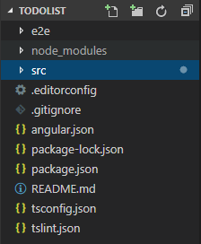

#### 环境搭建

+ 安装最新版Node


+ 全局安装 AngularCLI 脚手架工具

 AngularCLI是一个命令行界面工具，可以创建项目、添加文件以及执行其他开发任务，如测试、打包和发布

```markdown
– 命令：npm install-g @angular/cli
– 只需安装一次
– 可安装淘宝镜像
npm install -g cnpm --registry=https://registry.npm.taobao.org
```

#### 项目创建及概览

+ 创建项目：命令 `ng new  项目名称`


+ 进入项目：命令 `cd  项目名称`


+ 启动服务器：`ng serve --open`

```markdown
ng serve命令会启动开发服务器
--open可以自动打开浏览器并访问http://localhost:4200
```

##### 目录文件结构



src  文件夹：包含所有 Angular组件、模板、样式、图片以及应用所需的任何东西，这个文件夹之外的文件都是为构建应用提供支持用的

```markdown
# app/app.component.{ ts,html,css,spec.ts }
使用 HTML 模板、CSS 样式和单元测试定义 AppComponent 组件。 它是根组件，随着应用的扩展它会成为一棵组件树的根节点
# app/app.module.ts
定义 AppModule，根模块为 Angular 描述如何组装应用
# assets/
存放图片等任何静态资源，在构建应用时，它们全都会拷贝到发布包中
# environments/
存放各个目标环境准备的文件
# index.html
主页面的 HTML 文件，一般情况下不用编辑，在构建应用时，CLI 会自动把所有 js 和 css 文件添加进去
# main.ts
应用的主要入口，使用 JIT  编译器编译本应用，并启动应用的根模块AppModule，使其运行在浏览器中
# styles.css
全局样式，大多数情况下，会在组件中使用局部样式，以利于维护，而那些影响整个应用的样式需集中存放在这里
 browserslist、karma.conf.js、polyfills.ts、tslint.json、tsconfig.{app|spec}.json    ---  程序配置文件
```

##### 项目启动过程

- angular.json  定义了应用程序启动时加载的 HTML 页面（index.html）和脚本文件 （ main.ts ）
- main.ts 中定义了程序启动的模块（APPModule ）
- app.module.ts 中定义了程序启动的组件（ AppComponent ）
- app.component.ts 中定义了组件的模板及使用组件时的选择器名称（ app-root）
- 程序将在 index.html中检索`<app-root>`，将其替换成组件中的内容

  #### 模板语法

+ 插值表达式 {{ }}

+ 属性绑定  -- [ 属性名 ] = `“  ”` **从根组件到模板类**

+ 事件绑定  --（事件名）=  `“eventFun()”` **从模板类到根组件**

+ 双向数据绑定 -- [( ngModel)]  数据通过属性绑定从组件传到输入框，用户的修改通过事件绑定传回组件，把属性值设置为最新的值

  注意在`app.module.ts`中引入：`FormsModule`

  `import {FormsModule }from '@angular/forms';`

  `imports:[ BrowserModule, FormsModule ]` 


+ 条件判断 --`*ngIf`  应用到元素上（宿主元素），可以往DOM中添加或移除这个元素;当`*ngIf` 的表达式为真的时候，这个元素会显示，当表达式的值为假的时候，这个元素不会显示。


+ 数据循环  --*ngFor

  `<div *ngFor="letitem of arr">{{item}}</div>`

  含索引循环`<div*ngFor="letitem of arr;leti=index">{{item}}</div>`  

`app.component.html`

```html
<!--app.component.html-->
<!--# 插值表达式 {{}}-->
<h3>{{txt}}</h3>
<!--# 属性绑定  -- [ 属性名 ] = “  ”-->
<h3 [innerHTML]="txt"></h3>
<!--# 时间绑定 -- （事件名） = “fun()”-->
<button (click)="fun()">click</button>
<!--# 双向数据绑定-->
<input type="text" [(ngModel)]="value" />
<!--# 条件判断 -- *ngIf-->
<button (click)="fun()" *ngIf="20<10>click</button>
<!--# 数据循环 -- *ngFor-->
<ul>
    <li *ngFor="let item of arr;let i = index;">
        <input type="checkbox"> 这是第{{item}}个
        <button (click)="delete(i)">删除</button>
    </li>
</ul> 
```

`app.component.ts`

```typescript
import { Component } from '@angular/core';

@Component({
  selector: 'app-root',
  templateUrl: './app.component.html',
  styleUrls: ['./app.component.css']
})
export class AppComponent {
  txt:string = 'angular'; // 定义的属性 属性的类型是string 默认是public类型的
  value:string;
  fun(){
  	this.txt = 'angular.js';
  }
  arr:number[]=[1,2,3,4,5];
  delete(i){
  	this.arr.splice(index,1);
  }
}
```

`app.module.ts`

```typescript
import { BrowserModule } from '@angular/platform-browser';
import { NgModule } from '@angular/core';

import { AppComponent } from './app.component';
import {FormsModule} from '@angular/forms';// 引入
@NgModule({
  declarations: [
    AppComponent
  ],
  imports: [
    BrowserModule,// 引入
    FormsModule// 引入
  ],
  providers: [],
  bootstrap: [AppComponent]
})
export class AppModule { }
```

#### 实现todolist功能

```typescript
import { Component, OnInit } from '@angular/core';

@Component({
  selector: 'app-todolist',
  templateUrl: './todolist.component.html',
  styleUrls: ['./todolist.component.css']
})
export class TodolistComponent implements OnInit {

  constructor() { }

  ngOnInit() {
  }
  runningArr: Msg[] = [];
  value: string;
  count: number = 0;

  key(e) {
    if (e.keyCode == 13) {
      this.runningArr.unshift(new Msg(this.value, false));
      this.value = "";
      this.arrCount();
    }
  };
  //删除
  runningDel(ruid) {
    this.runningArr.splice(ruid, 1);
    this.arrCount();
  };
  //改变
  change(id) {
    this.runningArr[id].done = !this.runningArr[id].done;
    this.arrCount();
  }
  //计数
  arrCount() {
    this.count = 0;
    this.runningArr.forEach((value) => {
      if (value.done == false) {
        this.count++;
      }
    });
  }
  clear() {
    this.runningArr = [];
  }
}

export class Msg {
  constructor(public title: string, public done: boolean) { }
}
```

```html
<header>
    <section>
        <div class="left">ToDoList</div>
        <div class="right">
            <input type="text" [(ngModel)]="value" (keydown)="key($event)" placeholder="添加ToDo" />
        </div>
    </section>
</header>
<section>
    <h3>正在进行<span>{{count}}</span></h3>
    <ng-container *ngFor="let jtem of runningArr;let j = index;">
        <li *ngIf="!jtem.done">
            <input type="checkbox" (click)="change(j)" />{{jtem.title}}
            <button (click)="runningDel(j)">delete</button>
        </li>
    </ng-container>
    <h3>已经完成<span>{{runningArr.length - count}}</span></h3>
    <ng-container *ngFor="let item of runningArr;let i = index;">
        <li *ngIf="item.done">
            <input type="checkbox" (click)="change(i)" checked />{{item.title}}
            <button (click)="runningDel(i)">delete</button>
        </li>
    </ng-container>
</section>
<footer>
    Copyright © 2014 todolist.cn
    <a href="#" (click)="clear()">clear</a>
</footer>
```

