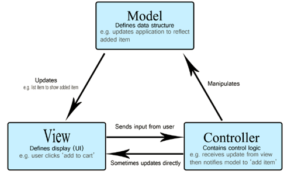
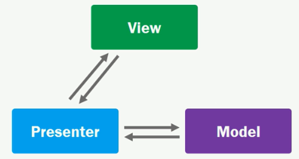
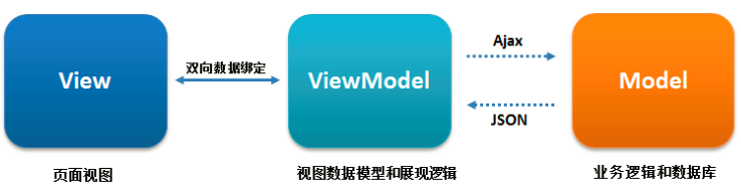
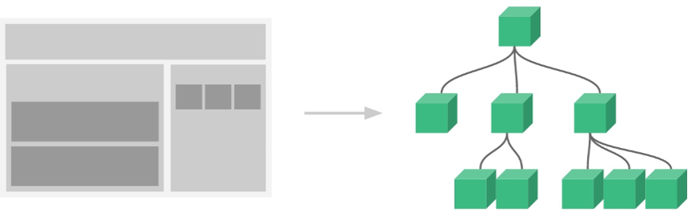
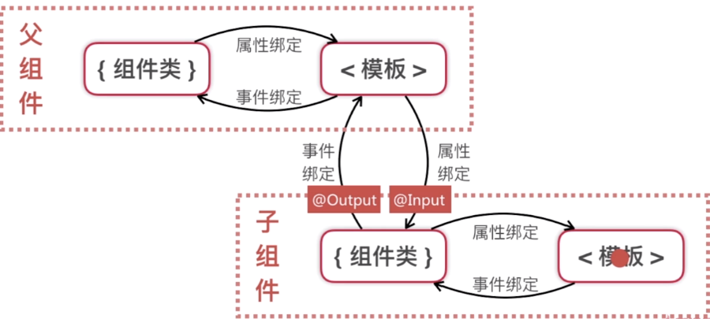
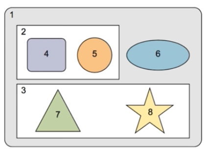
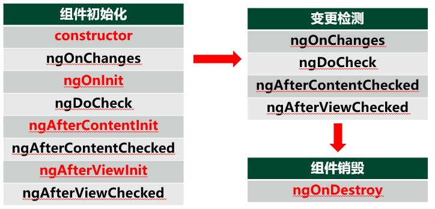
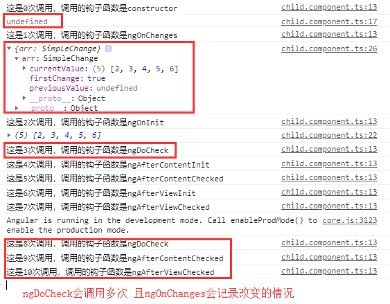
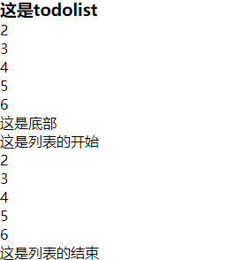

#### 框架模式

##### MVC

`MVC = Model（模型）、View（视图）、Controller（控制器）` 

`MVC(model,view,controller)`，一种将业务逻辑、数据、界面分离的方法组织代码的框架。在改进界面及用户交互的同时，不需要重写业务逻辑。MVC将传统的输入、处理和输出分离。

+ `Model`：模型，逻辑部分，也是表示应用程序的核心，比如说数据库的表和记录


+ `View`：视图，数据显示，也是表示界面，是用于显示的，比如说显示数据库的记录


+ `Controller`：控制器，用户交互，也是表示处理的，比如说处理/增删查改数据库的记录




##### MVP

`Model（模型）、View（视图）、Presenter（呈现）`

为了更细分视图（View）与模型（Model）的功能，让View更加专注于处理数据的可视化以及用户的交互，同时让Model只负责数据的处理，也就有了基于MVC概念的`MVP(Model-View-Presenter)`模式。 



- View:  主要负责绘制UI元素、与用户进行交互， Activity 处于MVP框架模式的V层，负责与用户界面互动 Activity通过接口与Presenter（可以理解为真正的指挥者）进行互动这样可以降低耦合。
- Model: 负责数据的存储、检索、操作。常实现一个 Model interface 来减低耦合
- Presenter:  作为 View 层 与 Model 层 交互的中间媒介（纽带）负责处理用户交互的复杂逻辑。实际上相当于指挥者。

##### MVVM

`MVVM = Model（模型）、View（视图）、View-Model（视图-模型）` 

 MVC框架一目了然，也非常好理解，随着App应用功能的强大Controller的负担越来越大因此在MVC的基础上繁衍出了MVVM框架



- Model指的是数据部分，对应到前端就是Javascript对象
- View指的是视图部分，对应到前端就是DOM
- ViewModel就是连接视图和数据的中间件，在MVM架构下视图和数据是不能直接通讯的,通常会通过ViewModel来做通讯，ViewModel通常要实现一个Observer观察者,当数据发生变化，ViewModel能够观察到这种数据

#### 组件

##### 组件的概念

+ 组件负责控制屏幕上的某一块区域，即视图


+ 组件是 Angular的核心理念，模块化机制是为组件化服务的



##### 组件的操作

+ 创建组件

命令： `ng g component components/componentName` 

在`AppModule`中声明组件：

1. **引入**：`import { ComponentName } from ‘./components/……'`
2. **声明**：在 declarations 数组中声明

**如果通过命令创建组件，angular会自动添加声明**

```javascript
// bash： ng g component components/todolist
import { TodolistComponent } from './components/todolist/todolist.component';
@NgModule({
  declarations: [
    AppComponent,
    TodolistComponent,
  ],
//...
```

+ 使用组件

```html
<!--比如在根组件就可以使用该标签来引入相应的内容-->
<app-componentName></app-componentName>
```

+ 组件的基本结构

```javascript
/*
(1) 组件装饰器---@component() 每个组件类必须用@component修饰才能成为Angular组件
(2) 组件元数据：selector、template、styles、providers、templateUrl、styleUrls
(3) 模板：每个组件只能关联一个模板，这个模板会渲染到页面上
(4) 组件类：定义组件的逻辑
*/
import { Component, OnInit } from '@angular/core';

@Component({
  selector: 'app-todolist',
  templateUrl: './todolist.component.html',
  styleUrls: ['./todolist.component.css']
})
export class TodolistComponent implements OnInit {

  constructor() { }

  ngOnInit() {
  }
}
```

##### 组件交互



+ 组件交互（父组件到子组件）  --@Input

子组件引入Input `import {Input }from '@angular/core';`

声明属性：@Input( ) 属性名;    

绑定属性：`<app-组件名  [ 属性名 ] = “属性值”></app-组件名>` 

+ 组件交互（子组件到父组件）  --@Output

子组件引入EventEmitter , Output `import {Component, EventEmitter,Output }from '@angular/core';`

子组件暴露 EventEmitter 属性，并用@Output( )装饰 `@Output() eventName =new EventEmitter();`    

通过 EventEmitter 的 emit 方法传递数据 `this.eventName.emit(data)`

父组件绑定事件，通过事件对象`$event`接收数据 `<app-组件名 (eventName)=“fun($event)”>`

```bash
# 通过命令创建两个组件
C:\Users\FUZIWANG>ng g component components/parent
C:\Users\FUZIWANG>ng g component components/child
```

`parent.component.html`

```html
<app-child [arr]="data" delIndex="del($event)"></app-child>
```

`parent.component.ts`

```javascript
import { Component, OnInit } from '@angular/core';

@Component({
  selector: 'app-parent',
  templateUrl: './parent.component.html',
  styleUrls: ['./parent.component.css'],
})
export class ParentComponent implements OnInit {
  constructor(private share:ShareService){}
  ngOnInit() {
    
  }
  data:number[] = [1,2,3,4,5];
  del(i){
  	this.data.splice(i,1);// 删除数据
  }
}
```

`child.component.html`

```html
<ul>
  <li *ngFor="let item of arr;let i = index;" (click)="del(i)">{{item}}
  </li>
</ul>
```

`child.component.ts`

```javascript
import { Component, OnInit, Input,EventEmitter,Output } from '@angular/core';

@Component({
  selector: 'app-child',
  templateUrl: './child.component.html',
  styleUrls: ['./child.component.css']
})
export class ChildComponent implements OnInit {
  constructor() { 
  }
  ngOnInit() {
  }
  @Input() arr;
  @Output() delIndex = new EventEmitter();
  del(i){
  	this.delIndex.emit(i);
  }
}
```

+ 中间人模式：拥有相同父组件的组件间交互



实战演练：利用中间人模式实现`todolist`的功能--[todolist](https://github.com/fuziwang/angular/tree/master/demo/app)

#### 生命周期

Angular每个组件都存在一个生命周期，从创建，变更到销毁

##### 生命周期钩子（lifecyclehook）

+ Angular提供组件生命周期钩子，把这些关键时刻暴露出来，赋予在这些关键时刻和组件进行交互的能力


+ Angular core 库里定义了生命周期钩子接口，每个接口都有唯一的一个钩子方法



+ ngOnChanges( )：检测到组件输入属性发生变化时调用


+ ngOnInit( )：在构造函数之后马上执行复杂的初始化逻辑，在 Angular设置完输入属性之后，对该组件进行准备，**只调用一次**


+ ngDoCheck( )：检测被 Angular忽略的更改


+ ngAfterContentInit( )：在投影（映射）内容初始化之后调用，只会调用一次


+ ngAfterContentChecked( )：在投影（映射）内容变更检测之后调用


+ ngAfterViewInit( )：在 Angular完全初始化了组件的视图后调用


+ ngAfterViewChecked( )：在默认的变更检测器完成了对组件视图的变更检测之后调用


+ ngOnDestroy( )：执行组件注销时的清理工作

`child.component.ts`

```typescript
import { Component, OnInit, Input,EventEmitter,Output } from '@angular/core';

@Component({
  selector: 'app-child',
  templateUrl: './child.component.html',
  styleUrls: ['./child.component.css']
})
export class ChildComponent implements OnInit {
  index:number = 0;
  log(msg){
    console.log('这是' + this.index++ + '次调用'，'调用的钩子函数是' + msg);
  }
  @Input() arr;
  @Output() delIndex = new EventEmitter();
  del(i){
  	this.delIndex.emit(i);
  }
  constructor() { 
    this.log('constructor');
    console.log(this.arr);// 初识调用的时候是一个空的数组还没有任何东西
  }
  ngOnInit() {
    this.log('ngOnInit');
    console.log(this.arr);// 此时才会数组的内容才会被初始化
  }
  ngOnChanges(changes) {
    this.log('ngOnChanges');// 检测到组件输入属性发生变化时调用
    console.log(changes);
  }
  ngDoCheck() {
    this.log('ngDoCheck');//change调用只能当arr的值发生改变的时候进行调用，如果arr的内部的修改change是检测不到的，因此需要使用ngDocheck
  }
  ngAfterContentChecked(){
    this.log('ngAfterContentChecked');   
  }
  ngAfterViewChecked(){
    this.log('ngAfterViewChecked');
  }
  ngAfterContentInit(){
    this.log('ngAfterContentInit');
  }
  ngAfterViewInit() {
    this.log('ngAfterViewInit');
  }

  @Input() arr;//从父组件那里传进来的数据
  @Output() delIndex = new EventEmitter();
  del(i){
    this.delIndex.emit(i);
  }
}
```



##### ng-content（内容映射）

+ 在组件中嵌入模板代码的占位符，告诉 angular在何处插入模板代码


+ 方便定制**可复用**的组件，当有多个映射时，模板代码取类名进行区分，ng-content通过select属性进行绑定

```markdown
父组件中：
<app-component>
<divclass=“header”>……</div>
</app-component>
子组件中：<ng-contentselect=“.header”></ng-content>
```

`child.component.html`

```html
<ng-content select=".header"></ng-content>
<ul>
    <li *ngFor="let item of arr;let i = index" (click)="del(i)">
        {{item}}
    </li>
</ul>
<ng-content select=".footer"></ng-content>
```

`parent.component.html` 这样可以实现child代码的复用（通过select选择器）

```html
<app-child [arr]="data1" (delIndex)="del($event)">
    <h3 class="header">这是todolist</h3>
    <footer class="footer">这是底部</footer>
</app-child>
<app-child [arr]="data1">
    <p class="header">这是列表的开始</p>
    <p class="footer">这是列表的结束</p>
</app-child>
```

