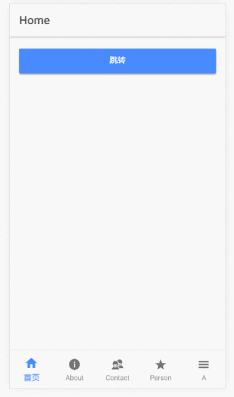
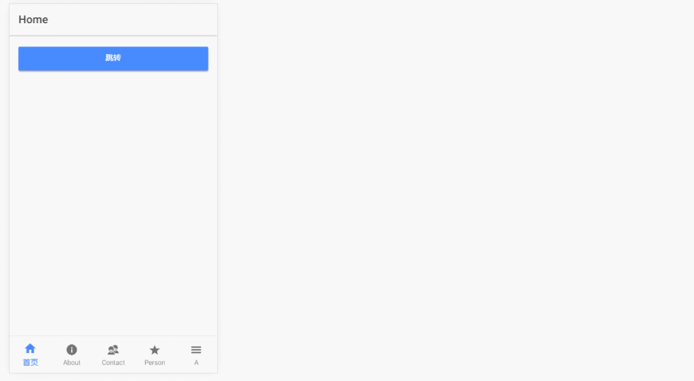

#### ionic

ionic 是一个强大的 HTML5 应用程序开发框架(HTML5 Hybrid Mobile App Framework )。 可以帮助您使用 Web 技术，比如 HTML、CSS 和 Javascript 构建接近原生体验的移动应用程序。

ionic 主要关注外观和体验，以及和你的应用程序的 UI 交互，特别适合用于基于 Hybird 模式的 HTML5 移动应用程序开发。

ionic是一个轻量的手机UI库，具有速度快，界面现代化、美观等特点。为了解决其他一些UI库在手机上运行缓慢的问题，它直接放弃了IOS6和Android4.1以下的版本支持，来获取更好的使用体验。

+ ionic官方说明文档 https://ionicframework.com/docs/
+ ionic中文说明文档http://www.ionic.wang/js_doc-index.html
+ ionic视频教程https://pan.baidu.com/s/1eTyvq5W

#### 项目搭建

+ 环境搭建

```bash
# 在npm环境下安装ionic cordova
npm install -g ionic@3.20.0 
npm install –g cordova@8.0.0
```

+ 项目创建

```bash
命令：ionic  start 项目名 参数(blank/tabs/sidemenu)
# 例如 ionic start ionicApp tabs
# 参数说明：
# blank : 空白项目 
# tabs : 带底部切换的项目
# sidemenu: 带侧边栏的项目
```

+ 项目启动

命令：`ionic  serve`

+ 目录结构分析


#### 路由配置

##### 路由配置 -- tabs

`<ion-tabs>`实现在应用程序的不同页面之间导航，是`<ion-tab>`的容器。`selectedIndex` 属性可设置首次加载时的默认加载项，第一次加载时，默认选择的选项卡的索引值。如果没有设置索引，它将默认使用0，即第一个选项卡。

`<ion-tab>`添加路由选项

+ root 属性设置该项加载的页面


+ tabTitle 属性设置该项上显示的可选文本


+ tabIcon 设置可选图标

```html
<!--tabs.html-->
<ion-tabs selectedIndex="1">
    <ion-tab [root]="tab1Root" tabTitle="首页" tabIcon="home"></ion-tab>
    <ion-tab [root]="tab2Root" tabTitle="About" tabIcon="information-circle"></ion-tab>
    <ion-tab [root]="tab3Root" tabTitle="Contact" tabIcon="contacts"></ion-tab>
</ion-tabs>
```

```typescript
// tabs.ts
import { Component } from '@angular/core';
import { AboutPage } from '../about/about';
import { ContactPage } from '../contact/contact';
import { HomePage } from '../home/home';

@Component({
  templateUrl: 'tabs.html'
})
export class TabsPage {
  tab1Root = HomePage;
  tab2Root = AboutPage;
  tab3Root = ContactPage;
  constructor() {
  }
}
```

##### 新增页面配置路由

+ 创建页面

```bash
命令：ionic g  page  页面名
# ionic g page person
```

+ 在`app.module.ts` 引入组件，注册组件

```typescript
// import {页面名Page }from '../pages/页面名/页面名';
// 在 declarations和entryComponents 中注册
...
import {PersonPage} from '../pages/person/person';

@NgModule({
  declarations: [
    ...
    PersonPage,
  ],
  imports: [
    BrowserModule,
    IonicModule.forRoot(MyApp)
  ],
  bootstrap: [IonicApp],
  entryComponents: [
	...
    PersonPage,
  ],
  providers: [
    StatusBar,
    SplashScreen,
    {provide: ErrorHandler, useClass: IonicErrorHandler}
  ]
})
export class AppModule {}
```

+ 在 tabs.ts 页面引入组件，配置组件

```typescript
import { Component } from '@angular/core';

import { AboutPage } from '../about/about';
import { ContactPage } from '../contact/contact';
import { HomePage } from '../home/home';
import {PersonPage} from '../person/person'// 在tab.ts中引入组件

@Component({
  templateUrl: 'tabs.html'
})
export class TabsPage {

  tab1Root = HomePage;
  tab2Root = AboutPage;
  tab3Root = ContactPage;
  tab4Root = PersonPage;
  tab5Root = 'APage';//对于页面有很多静态资源的情况下（比如网商购物页面），为了节省用户流量和提高页面性能，可以在用户浏览到当前资源的时候，再对资源进行请求和加载。 可以使用懒加载的模式 在加载的时候调用资源
  constructor() {

  }
}
```

#### 视图切换

##### NavController  

+ NavController 代表特定历史的视图数组，这个数组类似于一个堆栈


+ 该数组可以通过推送和弹出视图或者在历史中的任意位置插入和删除视图来控制整个应用程序。

```typescript
// 注入NavController
//import{ NavController }from 'ionic-angular';
// 构造函数中声明：constructor(publicnavCtrl: NavController) { }
import { Component } from '@angular/core';
import { NavController } from 'ionic-angular';
import { APage } from '../a/a';

@Component({
  selector: 'page-home',
  templateUrl: 'home.html'
})
export class HomePage {

  constructor(public navCtrl: NavController) {

  }
  goSub(){
    this.navCtrl.push(APage,{id:1});
  }
}
```

##### NavController常用方法  

`push (page,params)`  --  将新视图推入导航堆栈

+ page: 推入导航堆栈的组件名


+ params ：传递给下一个视图的数据（对象类型）

`pop`-- 从导航堆栈中删除视图

```html
<!--home.html-->
<ion-header>
    <ion-navbar>
        <ion-title>Home</ion-title>
    </ion-navbar>
</ion-header>

<ion-content padding>
    <button ion-button block (click)="goSub()">跳转</button>
    <!--block 长条 ion-button表示按钮的基本样式-->
</ion-content>
```

```typescript
import { Component } from '@angular/core';
import { NavController } from 'ionic-angular';
import { APage } from '../a/a';// 需要引入

@Component({
  selector: 'page-home',
  templateUrl: 'home.html'
})
export class HomePage {

  constructor(public navCtrl: NavController) {

  }
  goSub(){
    this.navCtrl.push(APage);
  }
}
```



##### 数据接收

引入 `NavParams` ：`import{NavParams} from 'ionic-angular';`

+ data属性：接收的数据，数据将以对象的形式进行展示


+ get方法：得到相对应的属性的属性值

```typescript
// home.ts
import { Component } from '@angular/core';
import { NavController } from 'ionic-angular';
import { APage } from '../a/a';// 需要引入

@Component({
  selector: 'page-home',
  templateUrl: 'home.html'
})
export class HomePage {

  constructor(public navCtrl: NavController) {

  }
  goSub(){
    this.navCtrl.push(APage,{id:1});
  }
}
```

```typescript
// a.ts
import { Component } from '@angular/core';
import { IonicPage, NavController, NavParams } from 'ionic-angular';

@IonicPage()
@Component({
  selector: 'page-a',
  templateUrl: 'a.html',
})
export class APage {
  constructor(public navCtrl: NavController, public navParams: NavParams) {
  }

  ionViewDidLoad() {
    // console.log(this.navParams.data.id);// this.navParams.data表示的是这个数据对象
    console.log(this.navParams.get('id'));
  }
}
```

