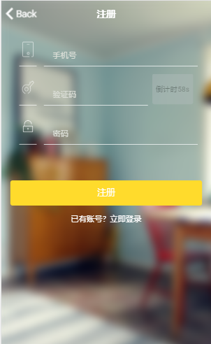

#### 列表

列表是几乎所有移动应用程序中广泛使用的界面元素，可以包括文本、按钮，切换、图标和缩略图等内容

##### 普通用法

+ 作为一个元素

```html
<!--As a element-->
<ion-list>
  	<ion-list-header>Header</ion-list-header>
  	<ion-item>Item</ion-item>
    <ion-item-divider>Item Divider</ion-item-divider>
</ion-list>
<!--
(1) ion-list-header:默认有一条下划线
(2) ion-item:默认有一条下线 在ion-list的最后一个ion-item中下划线会铺满全屏
(3) ion-item-divider item与item之间的分隔
-->
```

+ 作为元素属性

```html
<!--As a attribute-->
<button ion-item (click)="buttonClick()">Button Item</button>
<a ion-item href="https://www.ionicframework.com">Anchor Item</a>
```


##### 箭头

默认情况下`<a>` 和 `<button>` 已经添加了向右箭头，需要删除需添加`detail-none` ，需要添加箭头用`detail-push` 属性

```html
<ion-item detail-push>Item with Detail Arrow</ion-item>

<button ion-item (click)="buttonClick()">Button Item with Detail Arrow</button>

<a ion-item detail-none href="https://www.ionicframework.com">
  Anchor Item with no Detail Arrow
</a>
```

##### 其他特性

```html
<button ion-item>
  <ion-icon name="star" item-content></ion-icon>Button Item
</button>
<button ion-item>
  <ion-icon name="star" item-start></ion-icon>Button Item
</button>
<button ion-item>
  <ion-icon name="star" item-end></ion-icon>Button Item
</button>
<ion-item no-lines>Item with no border</ion-item>
<ion-item text-wrap>
  Multiline text that should wrap when it is too long
  to fit on one line in the item.
</ion-item>
```

| Attribute      | Description                              |
| -------------- | ---------------------------------------- |
| `item-start`   | Placed to the left of all other elements, outside of the inner item. |
| `item-end`     | Placed to the right of all other elements, inside of the inner item |
| `item-content` | Placed to the right of any `ion-label`, inside of the input wrapper. |


#### 列表的相关应用

##### 头像列表

```html
<!--头像列表例如微信主页的好友-->
<ion-item>
    <ion-avatar item-start>
      
    </ion-avatar>
    Avatar Item
    <button ion-button outline item-end>View</button>
</ion-item>
```

##### 缩略图列表

```html
<!--缩略图的实例例如 微信的我的Frewen清澄-->
<ion-item>
    <h2>Item</h2>
    <p>Item Paragraph</p>
    <ion-thumbnail item-end>
      
    </ion-thumbnail>
</ion-item>
```


##### 滑动列表

```html
<ion-item-sliding #item>
    <ion-item>
      Item
    </ion-item>
    <ion-item-options side="left">
      <button ion-button (click)="favorite(item)">Favorite</button>
      <button ion-button color="danger" (click)="share(item)">Share</button>
    </ion-item-options>

    <ion-item-options side="right">
      <button ion-button (click)="unread(item)">Unread</button>
    </ion-item-options>
</ion-item-sliding>
```


#### 按钮及图标

按钮`<button>`

+ ion-button：定义按钮


+ color：定义颜色


+ full：填充可用宽度，无左右边框及圆角


+ block：填充可用宽度


+ round：圆角按钮


+  outline：带有边框的透明按钮样式


+ clear：没有边框的透明按钮样式

图标按钮 `<button><ion-icon></ion-icon></button>`

+ 图标：`<ion-icon  name=“图标名”></ion-icon>`


+  图标位置（设置在button标签上）
   + icon-start：图标在按钮左侧
   + icon-end：图标在按钮右侧
   + icon-only：只含有图标

```html
<!-- Colors -->
<button ion-button>Default</button>
<button ion-button color="secondary" clear>Secondary</button>
<button ion-button color="danger">Danger</button>
<button ion-button color="light">Light</button>
<button ion-button color="dark">Dark</button>
<!--
其中对于颜色的配置都放在了theme/variables.scss文件下
$colors: (
  primary:    #488aff,
  secondary:  #32db64,
  danger:     #f53d3d,
  light:      #f4f4f4,
  dark:       #222,
);
-->

<!-- Shapes -->
<button ion-button full>Full Button</button>
<button ion-button block>Block Button</button>
<button ion-button round>Round Button</button>

<!-- Outline -->
<button ion-button full outline>Outline + Full</button>
<button ion-button block outline>Outline + Block</button>
<button ion-button round outline>Outline + Round</button>

<!-- Icons -->
<button ion-button icon-start>
  <ion-icon name="star"></ion-icon>Left Icon
</button>
<button ion-button icon-end>
  Right Icon<ion-icon name="star"></ion-icon>
</button>
<button ion-button icon-only>
  <ion-icon name="star"></ion-icon>
</button>

<!-- Sizes -->
<button ion-button large>Large</button>
<button ion-button>Default</button>
<button ion-button small>Small</button>
```


#### 表单

表单-输入框  --  `ion-input`

- 行内标签输入框：`<ion-label>`
- 固定标签输入框： `<ion-label fixed>`
- 堆叠标签输入框：`<ion-label stacked>`
- 浮动标签输入框：`<ion-label floating>`
- 内嵌输入框：`inset（添加到父元素）`

表单-输入框  --  ion-textarea

```html
<ion-list>
    <!--Inline Label（默认）-->
    <ion-item>
      <ion-label>Inline Label</ion-label>
      <ion-input placeholder="Text Input"></ion-input>
    </ion-item>
	<!--fixed Label-->
    <ion-item>
      <ion-label fixed>Fixed Label</ion-label>
      <ion-input type="tel" placeholder="Tel Input"></ion-input>
    </ion-item>
	<!--no Label-->
    <ion-item>
      <ion-input type="number" placeholder="Number Input with no label"></ion-input>
    </ion-item>
	<!--stacked Label（默认显示堆叠状）-->
    <ion-item>
      <ion-label stacked>Stacked Label</ion-label>
      <ion-input type="email" placeholder="Email Input"></ion-input>
    </ion-item>
    <ion-item>
      <ion-label stacked>Stacked Label</ion-label>
      <ion-input type="password" placeholder="Password Input"></ion-input>
    </ion-item>
	<!--floating Label当鼠标点击到该input时，样式变为堆叠状-->
    <ion-item>
      <ion-label floating>Floating Label</ion-label>
      <ion-input></ion-input>
    </ion-item>
	<!--clearInput Label（带有删除键）-->
    <ion-item>
      <ion-input placeholder="Clear Input" clearInput></ion-input>
    </ion-item>
	<!--textarea可以实现多行文本的输入-->
    <ion-item>
      <ion-textarea placeholder="Enter a description"></ion-textarea>
    </ion-item>
</ion-list>
```


#### 项目实战：完成注册页面



```html
<ion-header no-border>
  <ion-navbar color="tran"><!--tran表示的是透明色-->
    <ion-title>注册</ion-title>
  </ion-navbar>
</ion-header>

<ion-content padding>
  <ion-list>
    <ion-item no-lines>
      <ion-label></ion-label>
      <ion-input type="tel" placeholder="手机号"></ion-input>
    </ion-item>
    <ion-item no-lines>
        <ion-label></ion-label>
        <ion-input type="text" placeholder="验证码"></ion-input>
        <button ion-button item-end disabled>倒计时58s</button>
    </ion-item>
    <ion-item no-lines>
        <ion-label></ion-label>
        <ion-input type="password" placeholder="密码"></ion-input>
    </ion-item>
  </ion-list>
  <button ion-button block color="yellow">注册</button>
  <p><a>已有账号？立即登录</a></p>
</ion-content>
```

```css
page-reg {
    ion-content{
        background: url(../../assets/imgs/bg.png);
        background-size:cover;
        ion-item:nth-child(2){
            height: 70px;
        }
        ion-item{
            background-color: transparent !important;
            ion-label img{
                width: 31px;
                height: 44px;
                position: relative;
                top:1px;
            }
            button{
                height: 55px !important;
                background-color: #b3bfbd !important;
                padding:5px;
                font-size:14px;
                line-height: 55px;
                text-align: center;
                position: relative;
                top:-30px;
                color:#333 !important;
            }
            ion-input{
                border-bottom:0.5px solid #f2f5f5 !important;
                margin-left:5px;
                color:#dbded7 !important;
                button{
                    position: relative;
                    right:0px;
                }
            }
            input::-webkit-input-placeholder {
                font-size:14px;
              color: #dbded7 !important;
            }
        }
        button{
            margin-top:50px !important;
            color:#fff !important;
        }
        p{
            text-align: center;
            a {
              color: #fff;
            }
        }
    }
}
```